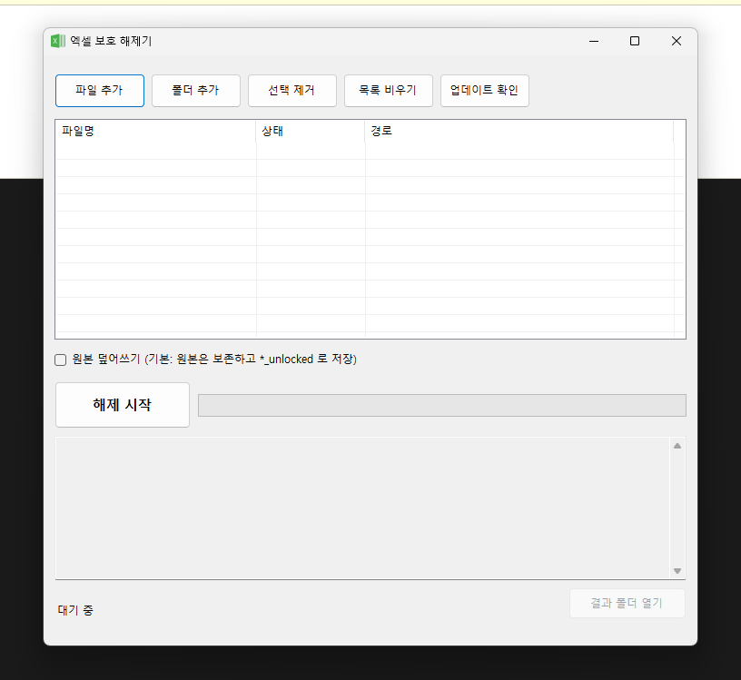

# 🔓 엑셀 보호 해제기 (Unlocker for Excel Sheet)

> 비밀번호를 잊어버려 편집할 수 없게 된 **내 엑셀 파일**의 시트/통합문서 보호와
> 열기 암호를 해제해 주는 Windows 데스크톱 앱입니다.

<p align="left">
  
  
  
  
</p>

---

## 📸 스크린샷

<p align="center">
  
</p>

---

## ✨ 주요 기능

- **여러 종류의 엑셀 "보호"를 한 번에 해제**
- **일괄 처리** — 여러 파일이나 폴더를 한꺼번에 큐에 넣어 순차 해제
- **드래그 앤 드롭** — 파일/폴더를 창에 끌어다 놓으면 바로 추가
- **원본 보존** — 기본적으로 `원본명_unlocked.xlsx` 로 저장(원본은 그대로). 옵션으로 덮어쓰기 선택 가능
- **비동기 처리 + 진행률** — 큰 파일에서도 화면이 멈추지 않음
- **결과 로그 / 파일별 상태 표시**
- **자동 업데이트 확인** — GitHub Releases 에서 새 버전을 감지해 알림

### 해제할 수 있는 보호 종류

| 보호 종류 | 설명 | 지원 |
|---|---|:---:|
| 시트 보호 (Sheet protection) | 셀 편집 잠금 (`sheetProtection`) | ✅ |
| 통합문서 보호 (Workbook protection) | 시트 추가/삭제/이동 잠금 (`workbookProtection`) | ✅ |
| 쓰기 예약 암호 (Write reservation) | 읽기 전용 권장 / 수정 암호 (`fileSharing`) | ✅ |
| **열기 암호 (파일 전체 암호화)** | 파일을 열 때 요구하는 암호 (AES 암호화) — **암호 입력 시 복호화** | ✅ |
| VBA 프로젝트 암호 | 매크로 편집기 잠금 | ⏳ 예정 |

### 지원 파일 형식

| 형식 | 지원 |
|---|:---:|
| `.xlsx` (통합문서) | ✅ |
| `.xlsm` (매크로 포함) | ✅ |
| `.xltx` / `.xltm` (서식 파일) | ✅ |
| `.xls` (97–2003 레거시) | 🔎 감지 후 안내 (해제는 예정) |

---

## 🚀 다운로드 & 실행

1. [**최신 릴리즈**](https://github.com/BaeTab/Unlocker_For_ExcelSheet/releases/latest) 에서
   `Unlocker_For_ExcelSheet-win-x64.exe` 를 내려받습니다.
2. 실행합니다. (별도 설치 불필요 — 단일 실행 파일, .NET 런타임 포함)
3. Windows SmartScreen 경고가 뜨면 *추가 정보 → 실행* 을 눌러 실행합니다.

> 앱 내 **[업데이트 확인]** 버튼으로 새 버전을 확인할 수 있고,
> 새 버전이 있으면 시작 시 하단 상태줄에 알림이 표시됩니다.

---

## 📖 사용 방법

1. **[파일 추가]** 또는 **[폴더 추가]** 로 엑셀 파일을 큐에 넣습니다. (창에 드래그도 가능)
2. 필요하면 **[원본 덮어쓰기]** 를 체크합니다. (기본값: 원본 보존, `*_unlocked` 로 저장)
3. **[해제 시작]** 을 누릅니다.
4. **열기 암호**가 걸린 파일은 처리 중 암호 입력 창이 뜹니다. (암호를 알아야 복호화 가능)
5. 완료되면 **[결과 폴더 열기]** 로 결과 파일을 확인합니다.

---

## ⚙️ 동작 원리

`.xlsx`/`.xlsm` 등 OOXML 파일은 내부가 **ZIP + XML** 구조입니다. 이 앱은:

1. 원본을 건드리지 않도록 임시 폴더에 복사본을 만들고,
2. 내부 XML(`xl/worksheets/*.xml`, `xl/workbook.xml`)을 **XML 파서로 정확히 분석**해
   `sheetProtection` · `workbookProtection` · `fileSharing` 요소를 제거한 뒤,
3. 성공하면 결과를 저장합니다.

**열기 암호**로 암호화된 파일은 ZIP 이 아니라 **CFB(OLE2) 컨테이너 + AES 암호화**
(ECMA-376) 이므로, 입력한 암호로 복호화한 뒤 위 과정을 적용합니다. (복호화에는
[NPOI](https://github.com/nissl-lab/npoi) 사용)

---

## 🛠️ 소스에서 빌드

```bash
# 요구: .NET 9 SDK, Windows
git clone https://github.com/BaeTab/Unlocker_For_ExcelSheet.git
cd Unlocker_For_ExcelSheet

# 실행
dotnet run --project Unlocker_For_ExcelSheet

# 단일 실행 파일(자체 포함) 게시
dotnet publish Unlocker_For_ExcelSheet/Unlocker_For_ExcelSheet.csproj \
  -c Release -r win-x64 --self-contained true \
  -p:PublishSingleFile=true -p:IncludeNativeLibrariesForSelfExtract=true
```

---

## ⚠️ 주의 (정당한 용도)

이 도구는 **본인이 소유했거나 해제 권한이 있는 파일**의 잊어버린 보호를 푸는 용도입니다.
타인의 파일이나 권한 없는 파일의 보호를 무단으로 해제하는 데 사용하지 마세요.
열기 암호를 **모르는** 경우의 복구(무차별 대입 등)는 지원하지 않습니다.

---

## 🧰 기술 스택

- **.NET 9** / **WinForms** (C#)
- `System.IO.Compression` (OOXML ZIP 편집), `System.Xml.Linq` (XML 수술)
- [NPOI](https://github.com/nissl-lab/npoi) (열기 암호 복호화)

## 📄 라이선스

[MIT](LICENSE)

## 🙌 기여

이슈 · PR 환영합니다.
